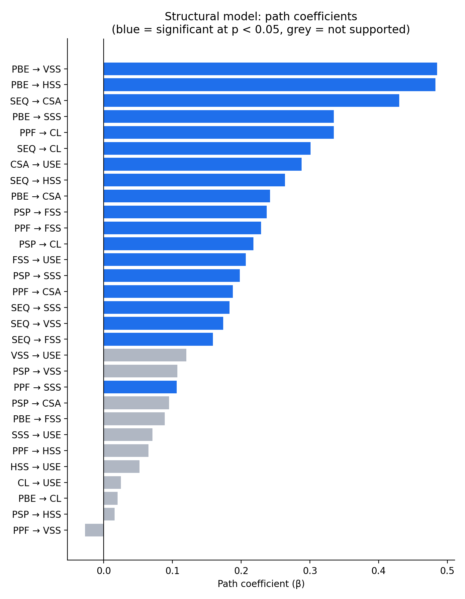
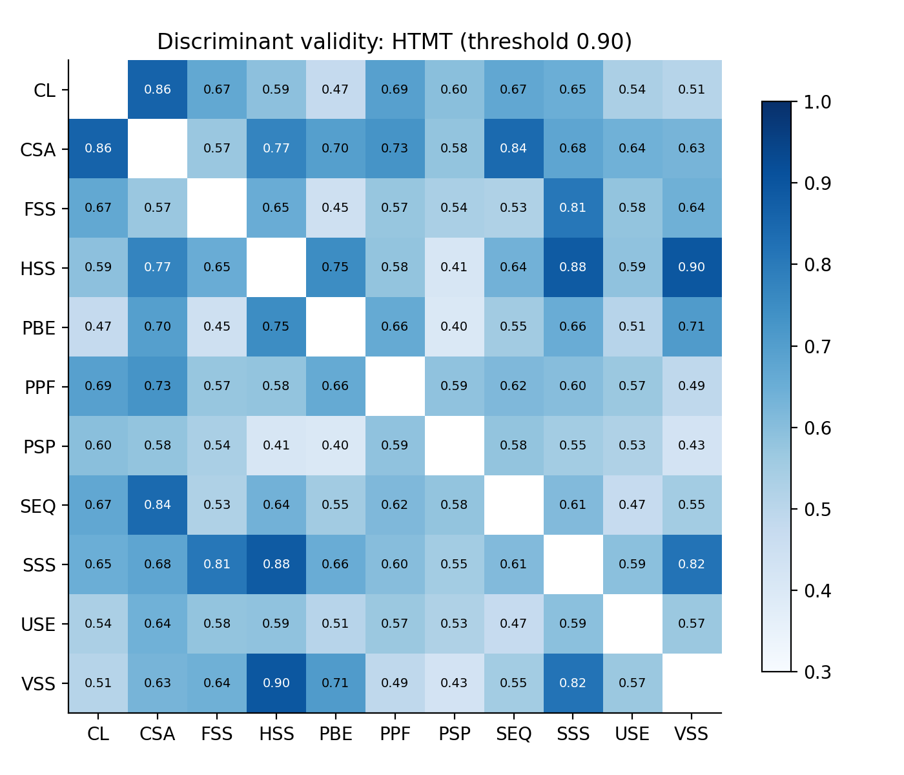
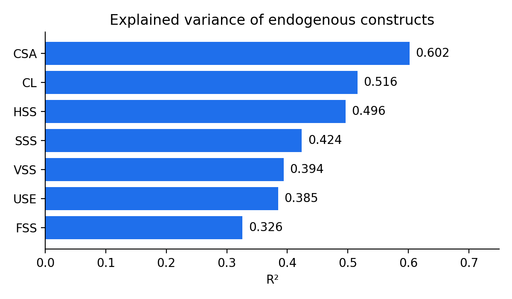
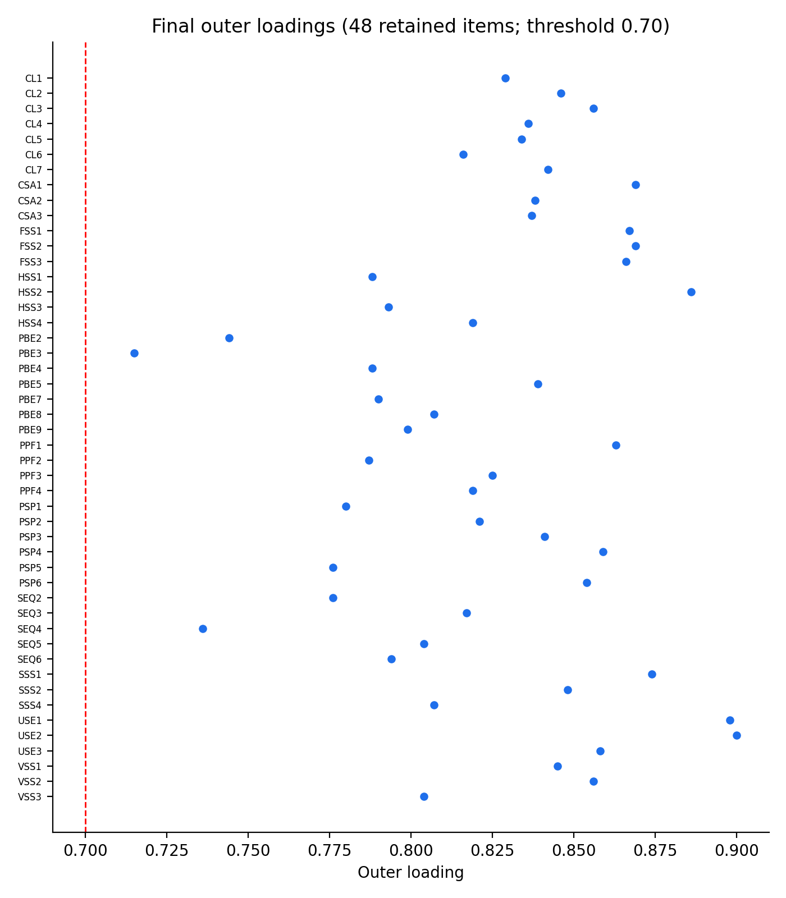

# From Ride-Hailing to Food Delivery: Drivers of Willingness to Use BeFood in the Be Super App

> PLS-SEM study of 300 young Vietnamese consumers · SmartPLS 4 · Submitted to the **UEH "Young Researcher" Award 2025** (Ho Chi Minh City University of Economics)

**Authors:** Linh Tran· **Supervisor:** Duong Ha My
**Keywords:** super app, PLS-SEM, TPB, TAM, synergy theory, customer satisfaction, cross-service adoption, Vietnam

---

## 1. Research question

Ride-hailing platforms such as Grab, Be and Gojek are expanding into food delivery, finance and insurance inside one "super app".
**Which factors make an existing ride-hailing user willing to also adopt the food-delivery service (BeFood) within the Be ecosystem?**

## 2. Conceptual model

Built on the Theory of Planned Behavior (Ajzen, 1991), the Technology Acceptance Model (Davis, 1989) and synergy theory.

| Layer | Constructs |
|---|---|
| **Perceived value** (exogenous) | Perceived Price Fairness (PPF), Perceived Benefits of Booking Apps (PBE), Perceived Sales Promotion (PSP), Perceived Service Quality (SEQ) |
| **Expected service synergy** (mediators) | Financial (FSS), Strategic (SSS), Vertical (VSS), Horizontal (HSS) |
| **Attitudinal mediators** | Customer Satisfaction (CSA), Customer Loyalty (CL) |
| **Outcome** | Willingness to Use BeFood (USE) |

Structural paths: {PPF, PBE, PSP, SEQ} → {CL, CSA, FSS, HSS, SSS, VSS} → USE (30 paths in total).

## 3. Data & method

- **Sample:** n = 300 respondents, mainly aged 16–25, in major Vietnamese cities (students and young professionals who use super apps).
- **Instrument:** 7-point Likert questionnaire adapted from international studies; 55 items initially, **48 retained** after purification.
- **Estimation:** PLS-SEM in SmartPLS 4 with bootstrapping; group comparisons via one-way ANOVA / Welch test in SPSS.
- **Measurement model:** iterative removal of items with outer loading < 0.70; then Cronbach's α, composite reliability (ρa, ρc), AVE, HTMT.
- **Structural model:** indicator VIF, R² / adjusted R², f², bootstrapped path coefficients.

## 4. Key findings

| Result | Value |
|---|---|
| Customer satisfaction → willingness to use | β = 0.288, p < 0.001 ✅ |
| Financial service synergy → willingness to use | β = 0.207, p = 0.004 ✅ |
| Loyalty, horizontal / strategic / vertical synergy → willingness to use | not supported (VSS: β = 0.120, p = 0.056, marginal) |
| Strongest antecedents of satisfaction | Service quality (β = 0.430), Booking-app benefits (β = 0.242) |
| Strongest antecedents of synergy perceptions | Booking-app benefits → VSS (0.485), HSS (0.483), SSS (0.335) |
| Variance explained in willingness to use | R² = 0.385 |
| Gender difference in willingness to use | Female > male (Welch p = 0.001); no difference by age or income |

**Takeaway for operators:** converting ride-hailing users into food-delivery users is driven by *satisfaction with the core service* and *financial-service synergy* (e.g. shared wallet / payment benefits) rather than by loyalty or promotions alone.

### Figures

| | |
|---|---|
|  |  |
|  |  |

## 5. Measurement-model quality

All 11 constructs meet the standard thresholds: Cronbach's α ≥ 0.784, ρc ≥ 0.874, AVE ≥ 0.615, all HTMT < 0.90, all indicator VIF < 3.
See [`results/`](results/) for every table in machine-readable CSV.

## 6. Repository structure

```
├── README.md
├── results/                 # All model outputs as CSV (loadings, reliability, HTMT, VIF, R², paths, ANOVA)
├── figures/                 # Generated figures
├── scripts/
│   ├── make_figures.py      # Rebuilds figures from results/*.csv
│   └── verify_reliability.py# Recomputes AVE and CR from loadings and checks vs. SmartPLS output
├── analysis/
│   └── seminr_model.R       # Model specification to replicate the PLS-SEM in R (needs the survey data)
├── docs/methodology.md      # Construct list, item purification log, analysis decisions
└── data/README.md           # Data availability statement
```

## 7. Reproduce

```bash
pip install -r requirements.txt
python scripts/verify_reliability.py   # integrity check: recomputed AVE / CR match reported values
python scripts/make_figures.py
```

To re-estimate the model from raw data, place an anonymised CSV in `data/` (see `data/README.md`) and run `analysis/seminr_model.R`.

## 8. Limitations

- Convenience sample skewed toward ages 16–25 in big cities; results may not generalise to older or rural users.
- Cross-sectional self-reported data: intention is measured, not actual BeFood usage.
- HTMT between horizontal and vertical synergy (0.896) is close to the 0.90 limit.
- Indirect (mediation) effects through satisfaction and synergy are a natural next step.

## 9. Citation

See [`CITATION.cff`](CITATION.cff). Code is MIT-licensed; the full research report is not redistributed here.
